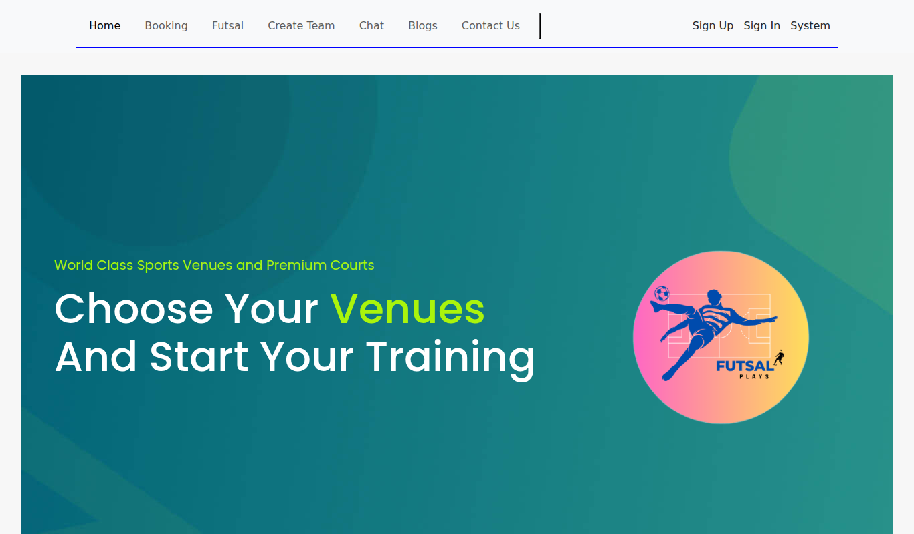
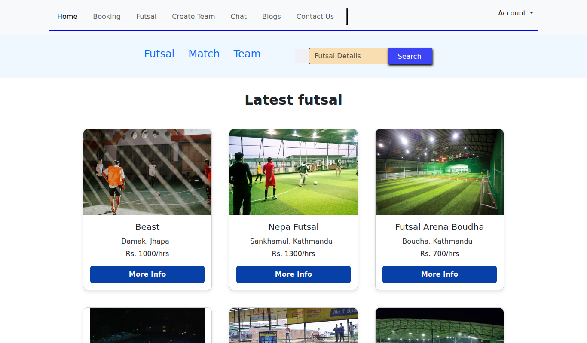
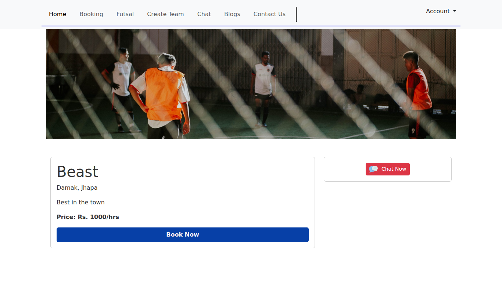
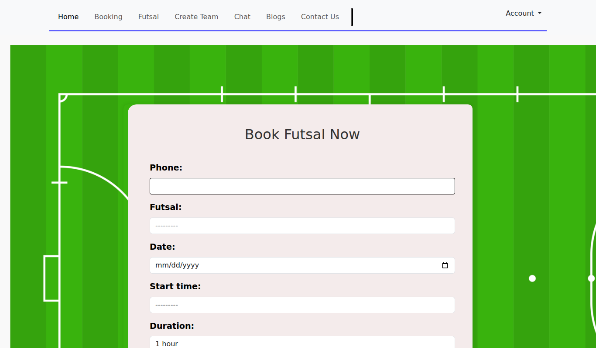
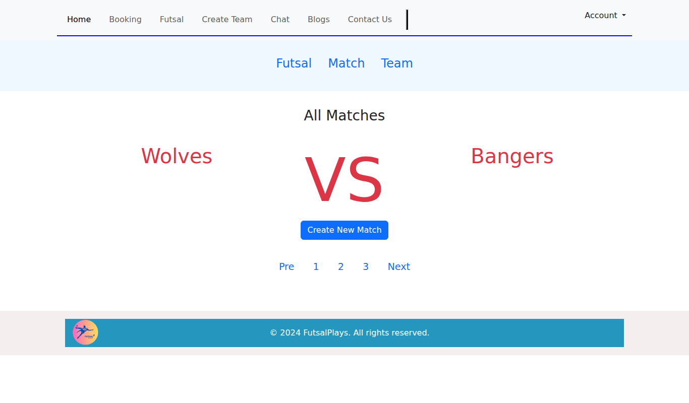
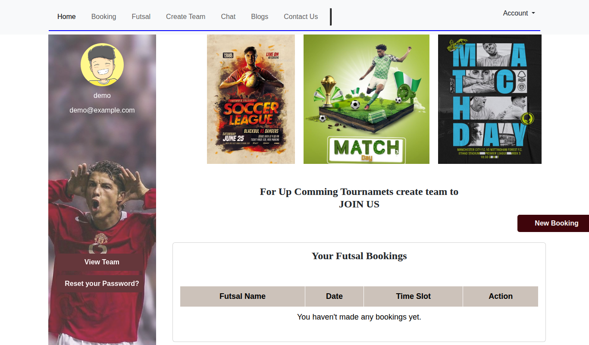
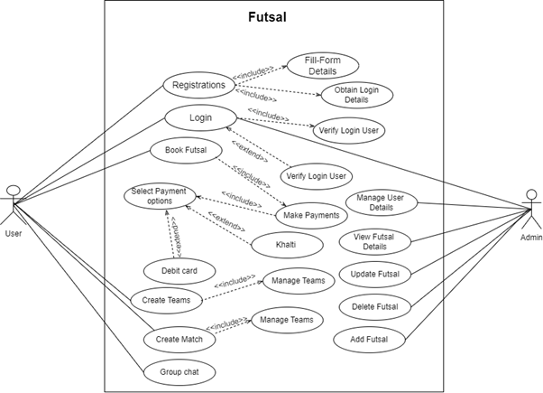
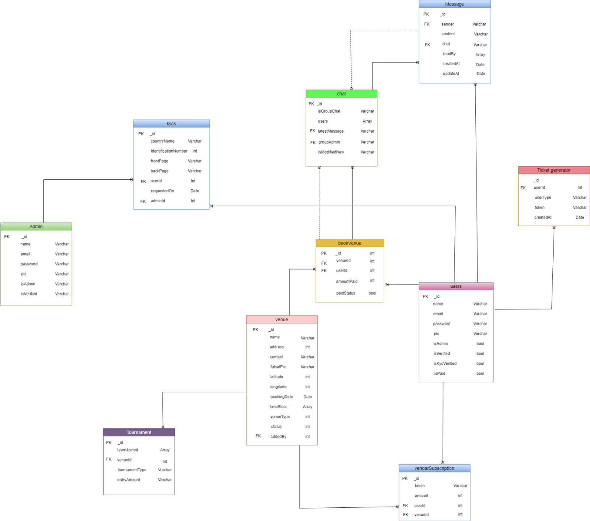

# Futsal Plays

A web app for finding, booking and organising futsal games. Players can browse futsal courts, book a time slot and pay online, create teams, set up matches against other teams and chat with other players.

This was my **Final Year Project** for the BSc (Hons) Computing degree at Islington College, Kathmandu (London Metropolitan University), module CS6P05NI, 2023/24. I built it between December 2023 and April 2024 and the commit history in this repository is the original one from that time.



## Why I built it

Booking a futsal court in Kathmandu usually meant calling the venue, checking times by phone and paying in cash. Finding enough players for a game was also hard. If one person dropped out, the whole game was often cancelled. I wanted one place where players could see available courts, book and pay online, and find other players or teams to play with.

## Features

**For players**
- Browse futsal venues with photos, location and price per hour
- Search venues by name or price
- Book a court for a date and time slot
- Pay online through the Khalti payment gateway (test mode)
- Download a PDF receipt for a booking
- Create a team and set up friendly or losers matches against other teams
- Group chat so a team can find a replacement player when someone is missing
- Venue recommendations based on the user's location
- Personal dashboard showing bookings and teams
- Sign up and log in with username and password or with Google

**For admins**
- Custom admin dashboard to manage venues, bookings, matches, teams, blogs, reviews and users
- Content management for the home page (slider, gallery, about, blog posts)

## Screenshots

| Venues | Venue details |
|---|---|
|  |  |

| Booking | Matches |
|---|---|
|  |  |



## Tech stack

- **Backend:** Python, Django 5
- **Database:** SQLite
- **Frontend:** Django templates, HTML, CSS, Bootstrap, JavaScript
- **Authentication:** django-allauth (including Google login)
- **Payments:** Khalti payment gateway
- **Other:** Google Geolocation API, geopy for distance calculation, xhtml2pdf for PDF receipts, Jazzmin admin theme

## Design

I followed the Rational Unified Process (RUP) for this project, starting with requirements gathering and a user survey, then use case, activity, sequence and ER diagrams before development.

| Use case diagram | Entity relationship diagram |
|---|---|
|  |  |

## How to run it

You need Python 3.10 or newer.

```bash
git clone https://github.com/bromishbista/FutsalPlays.git
cd FutsalPlays

python3 -m venv venv
source venv/bin/activate        # on Windows: venv\Scripts\activate
pip install -r requirements.txt

cp .env.example .env            # then add your own keys (optional, see below)

python manage.py migrate
python manage.py seed_demo      # loads demo venues, teams, a match and a demo user
python manage.py runserver
```

Then open http://127.0.0.1:8000 and log in with username `demo` and password `demo12345`.

The app runs without any API keys. To use online payment, password reset emails or location features, add your own keys to `.env`:

| Variable | What it is for |
|---|---|
| `KHALTI_PUBLIC_KEY`, `KHALTI_SECRET_KEY` | Test keys from the Khalti merchant dashboard |
| `EMAIL_HOST_USER`, `EMAIL_HOST_PASSWORD` | A Gmail address and app password for password reset emails |
| `GOOGLE_MAPS_API_KEY` | A Google Cloud key with the Geolocation API enabled |

## Project structure

```
Futsal/       project settings and main URLs
booking/      venues, bookings, payments, matches, teams, admin pages
user_acc/     sign up, login, user dashboard, contact form
groupchat/    chat groups and messages
templates/    HTML templates
static/       CSS, JavaScript and images
media/        uploaded images used by the demo data
```

## What I would improve

I'm sharing this as it was submitted, with only small fixes so it runs on a fresh machine. Looking back, these are the things I would do differently now:

- The group chat page is basic and does not update in real time. I would rebuild it with Django Channels and WebSockets.
- Several views are long and repeat similar code. I would split them up and move shared logic into helper functions.
- There are almost no automated tests. I would add unit tests for booking and payment logic.
- Khalti has since released a newer payment API (ePayment v2), so the payment code would need updating.
- It only runs with the Django development server. I would add PostgreSQL and a production setup for deployment.

## Changes made in 2026

When moving this project to my current GitHub account I made a few small changes so it works on any machine:

- Moved all keys and passwords out of the code into a `.env` file and removed them from the git history
- Removed the virtual environment folder and the local database from the repository
- Fixed a stray import that crashed the app on computers without Tkinter
- Moved a custom template filter that had been saved inside the virtual environment into the project
- Added missing packages to `requirements.txt` and a `seed_demo` command with demo data

## Author

Bromish Bista
